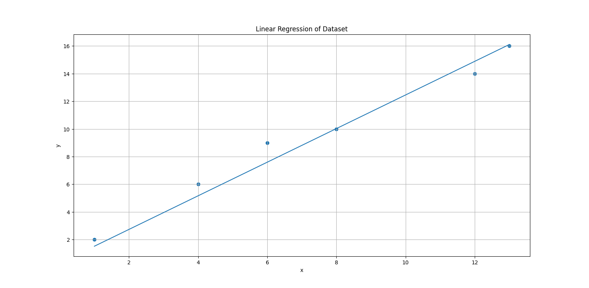
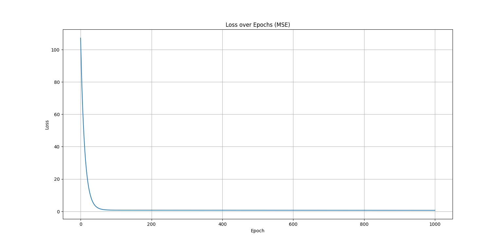

## Linear Regression From Scratch

## What this project does

Short visualization of gradient descent linear regression

## How it works

1. Accepts a weight and bias to predict a value
2. Compares with the actual value
3. Calculates the gradient based on the loss
4. Makes new weights and biases based on the gradient and learning rate
5. Makes an equation with the final weight and bias

## Results

